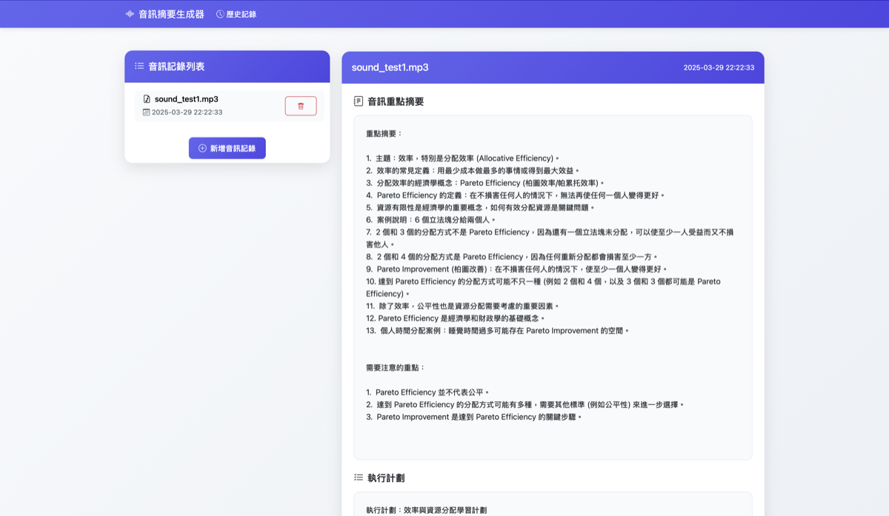
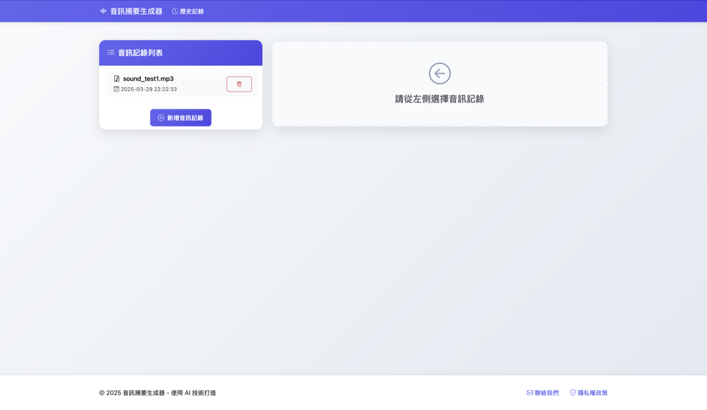

# 音訊摘要生成器

這是一個使用 FastAPI 和 Whisper 開發的音訊摘要生成工具，可以將音訊檔案轉換為文字摘要和執行計劃。

## 功能特點

- 支援 MP3 格式音訊檔案上傳
- 使用 Whisper 模型進行語音轉文字
- 使用 Gemini 模型生成摘要和執行計劃
- 提供歷史記錄管理功能
- 支援摘要下載
- 現代化的使用者介面

## 環境需求

- Python 3.8+
- FFmpeg（用於音訊處理）

## 安裝步驟

1. 克隆專案：
```bash
git clone https://github.com/YaoHung0315/meeting-summarizer.git
cd meeting-summarizer
```

2. 安裝 FFmpeg（根據您的作業系統）：

MacOS:
```bash
brew install ffmpeg
```

Ubuntu:
```bash
sudo apt update
sudo apt install ffmpeg
```

Windows:
- 從 [FFmpeg 官網](https://ffmpeg.org/download.html) 下載
- 添加到系統環境變數

3. 安裝 Python 依賴：
```bash
pip install -r requirements.txt
```

4. 設定環境變數：
- 創建 `.env` 檔案
- 添加您的 API 金鑰：
```
GOOGLE_API_KEY=your_api_key_here
```

## 使用方法

1. 啟動服務器：
```bash
cd web_app
uvicorn main:app --reload
```

2. 開啟瀏覽器訪問：
```
http://localhost:8000
```

## 注意事項

- 本專案需要 Google Gemini API 金鑰才能運作
- 請確保有足夠的磁碟空間用於暫存音訊檔案
- 建議使用現代瀏覽器（Chrome、Firefox、Safari 等）
- 音訊檔案僅支援 MP3 格式

## 系統架構

- 後端：FastAPI
- 語音轉文字：OpenAI Whisper
- 摘要生成：Google Gemini
- 前端：HTML/CSS/JavaScript
- 資料儲存：本地檔案系統

## 開發說明

本專案採用以下技術：
- FastAPI 用於建立 RESTful API
- Whisper 用於語音轉文字
- Gemini 用於生成摘要和執行計劃
- Bootstrap 用於前端設計
- Jinja2 用於模板渲染

## 授權

本專案使用 MIT 授權 - 詳見 [LICENSE](LICENSE) 檔案

## 作者

蔡曜鴻 (phank0315@gmail.com)

## 免責聲明

本專案僅供學習和研究使用，不建議用於生產環境。使用者需自行承擔使用風險。

## 部署說明

本專案不適合部署在 GitHub Pages 等靜態網站托管服務上，原因如下：

1. **後端需求**：
   - 專案需要 Python FastAPI 後端服務器
   - 需要處理檔案上傳和儲存
   - 需要執行 Whisper 模型進行語音識別

2. **API 金鑰安全性**：
   - 需要 Google Gemini API 金鑰
   - API 金鑰不應該公開在程式碼中
   - 需要安全的環境變數管理

3. **系統資源需求**：
   - 需要足夠的 CPU 資源運行 Whisper 模型
   - 需要磁碟空間存儲上傳的音訊檔案
   - 需要持續運行的服務器環境

## 建議的部署方式

1. **本地運行**：
   - 適合個人使用或開發測試
   - 按照上述安裝步驟在本地運行

2. **私有服務器**：
   - 使用 VPS 或私有服務器部署
   - 使用 Docker 容器化部署
   - 設置適當的安全措施

3. **雲端服務**：
   - 可使用 AWS、GCP、Azure 等雲端服務
   - 使用容器服務如 Kubernetes
   - 確保 API 金鑰安全存儲

## 系統畫面展示

### 首頁

- 簡潔的檔案上傳介面
- 支援拖放上傳
- 即時處理狀態顯示

### 摘要生成

- 清晰的摘要展示
- 結構化的執行計劃
- 一鍵下載功能

### 歷史記錄

- 歷史記錄管理
- 快速查看過往摘要
- 檔案刪除功能

## 聯絡方式

如果您對部署或使用有任何問題，歡迎聯絡：
- Email: phank0315@gmail.com
- GitHub: [YaoHung0315](https://github.com/YaoHung0315)